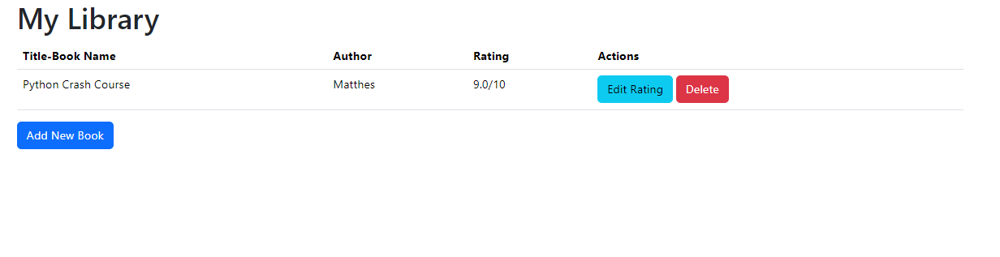

# Library Management

Simple web application designed using Flask and sqlite database to manage library of books, Users can add,edit, and delete book entries.

## Functionalities

- Add Books to Library
  - Book Name, Author name and Rating
- Edit Rating of the Book
- Delete Book

## Project Images

