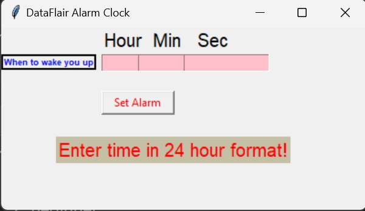

# Alarm-Clock-In-Python 

 <h1>Requirements</h1 >

- Python 3.x installed on your system.
- Tkinter library (usually comes pre-installed with  Python).
- The code provided in alarm_clock.py and clock.py f iles.
 
<h1>How To Use</h1>

- Navigate to the directory where you saved the files.
- Run the clock.py file by executing the command: python clock.py
- The clock.py window will be displaying the current time.
- The alarm_clock.py window will be used to set the alarm.
- Click the "Set Alarm" button in the alarm_clock.py window.
- When the alarm time is reached, a notification will pop up (or a sound will play if you add it to the code).

<h1>Output</h1>

